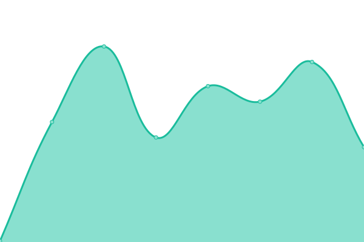

# [📈 Live Status](https://status.govee.tinkertechlab.com): <!--live status--> **🟧 Partial outage**

This repository contains the open-source uptime monitor and status page for [TinkerTechLab](tinkertechlab.com), powered by [Upptime](https://github.com/upptime/upptime).

With [Upptime](https://upptime.js.org), you can get your own unlimited and free uptime monitor and status page, powered entirely by a GitHub repository. We use [Issues](https://github.com/TinkerTechLab/TTLxGOVEE-Uptime/issues) as incident reports, [Actions](https://github.com/TinkerTechLab/TTLxGOVEE-Uptime/actions) as uptime monitors, and [Pages](https://status.govee.tinkertechlab.com) for the status page.

<!--start: status pages-->
<!-- This summary is generated by Upptime (https://github.com/upptime/upptime) -->
<!-- Do not edit this manually, your changes will be overwritten -->
<!-- prettier-ignore -->
| URL | Status | History | Response Time | Uptime |
| --- | ------ | ------- | ------------- | ------ |
|  [Main Website](https://govee.tinkertechlab.com) | 🟩 Up | [main-website.yml](https://github.com/TinkerTechLab/TTLxGOVEE-Uptime/commits/HEAD/history/main-website.yml) | 

 548ms
     
 | 

<a href="https://status.govee.tinkertechlab.com/history/main-website">100.00%</a>
    

|  [WebAPI Dashboard](https://govee.tinkertechlab.com/login) | 🟩 Up | [web-api-dashboard.yml](https://github.com/TinkerTechLab/TTLxGOVEE-Uptime/commits/HEAD/history/web-api-dashboard.yml) | 

 259ms
     
 | 

<a href="https://status.govee.tinkertechlab.com/history/web-api-dashboard">100.00%</a>
    

|  [Documentation](https://goveedocs.tinkertechlab.com) | 🟩 Up | [documentation.yml](https://github.com/TinkerTechLab/TTLxGOVEE-Uptime/commits/HEAD/history/documentation.yml) | 

 177ms
     
 | 

<a href="https://status.govee.tinkertechlab.com/history/documentation">100.00%</a>
    

|  [Uptime Status Page](https://status.govee.tinkertechlab.com) | 🟥 Down | [uptime-status-page.yml](https://github.com/TinkerTechLab/TTLxGOVEE-Uptime/commits/HEAD/history/uptime-status-page.yml) | 

 0ms
     
 | 

<a href="https://status.govee.tinkertechlab.com/history/uptime-status-page">100.00%</a>
    

<!--end: status pages-->

[**Visit our status website →**](https://status.govee.tinkertechlab.com)

## 📄 License

- Powered by: [Upptime](https://github.com/upptime/upptime)
- Code: [MIT](./LICENSE) © [Anand Chowdhary](https://anandchowdhary.com), supported by [Pabio](https://pabio.com)
- Data in the `./history` directory: [Open Database License](https://opendatacommons.org/licenses/odbl/1-0/)
